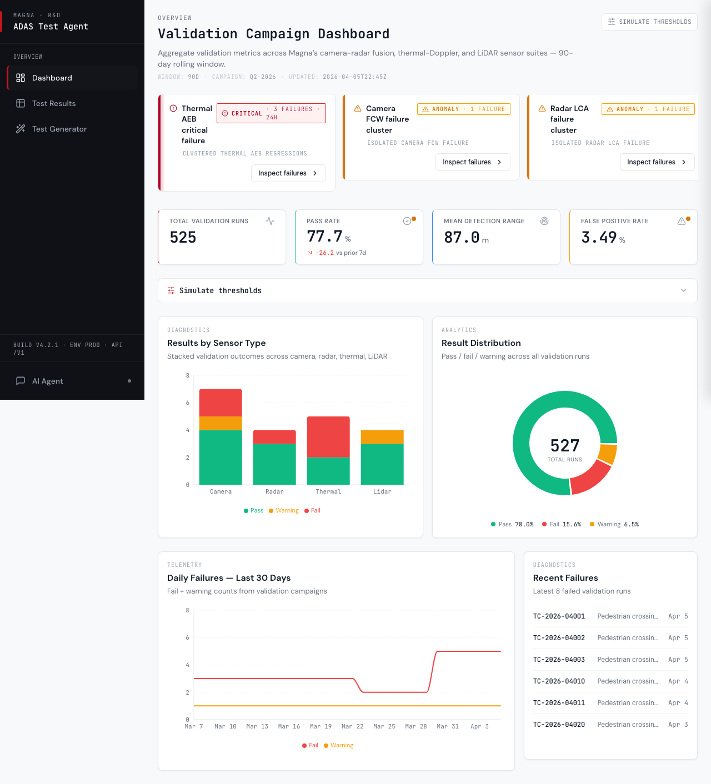
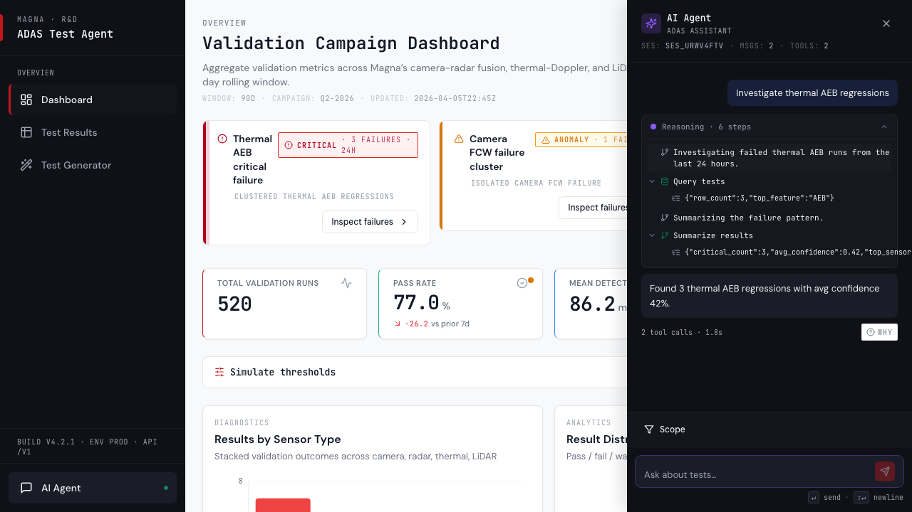
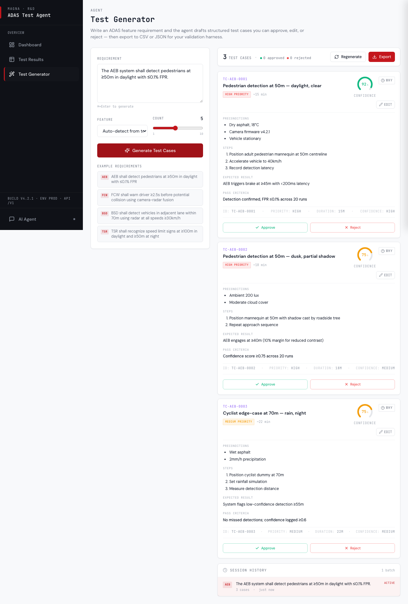
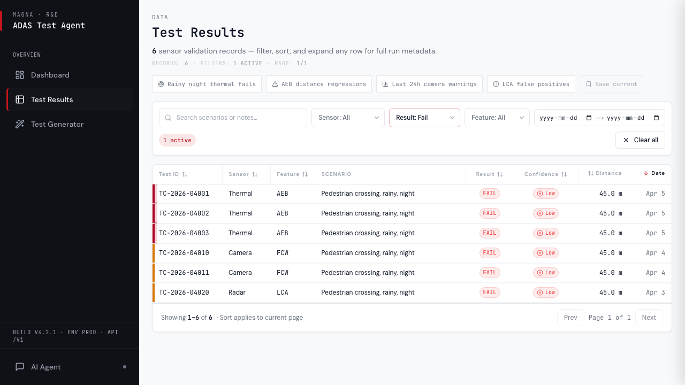
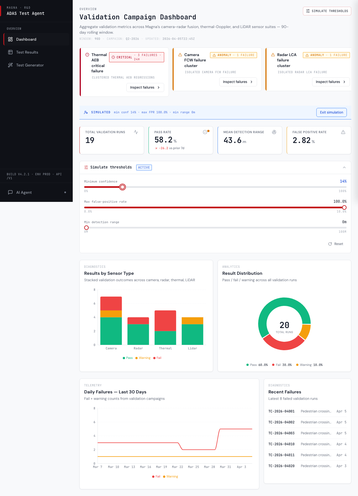
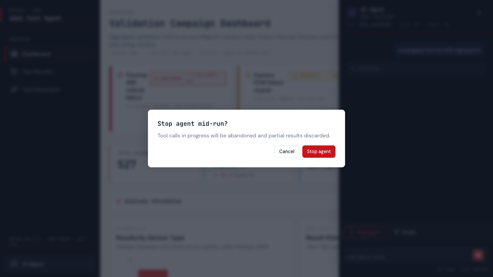
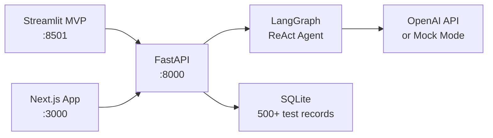

# ADAS Test Agent

*Internal R&D tool for automotive engineers to query ADAS sensor test results, auto-generate test cases, and visualize quality metrics — built as two apps sharing one FastAPI + LangGraph backend.*

<p align="center">
  
  
  
</p>
<p align="center">
  
  
  
</p>

> Built as a portfolio project for the **Magna International Agentic AI Application UI/UX Co-op** (R00233555). Demonstrates Streamlit-to-Next.js migration, reusable component library design, agentic AI integration, and frontend testing — the three core deliverables of the role.

---

## Live demos

- **Next.js (Vercel):** https://adas-test-agent.vercel.app *(placeholder — deploy before submission)*
- **Streamlit (Community Cloud):** https://adas-test-agent.streamlit.app *(placeholder)*
- **Storybook:** https://adas-test-agent-storybook.vercel.app *(placeholder)*

---

## Architecture



Three tiers: a shared **FastAPI backend** serves both frontends over HTTP, a **LangGraph ReAct agent** exposes four tools (query tests, query stats, generate test cases, infer feature) via SSE streaming, and **two frontends** consume identical endpoints — Streamlit for rapid prototyping, Next.js for production polish. The agent runs in real-LLM mode with an `OPENAI_API_KEY` or falls back to a deterministic mock mode so the demo works without any API key.

---

## Tech stack

| Layer | Tech |
|---|---|
| **Frontend (production)** | Next.js 15 · React 19 · TypeScript 5.6 (strict) · Tailwind CSS 3.4 · shadcn/ui primitives · Recharts 2.13 · SWR 2.4 · Vercel AI SDK 4 · Lucide React |
| **Frontend (prototype)** | Streamlit 1.39+ · Plotly 5.24 · Pandas 2.2 |
| **Backend** | FastAPI 0.115 · Uvicorn 0.32 · Pydantic 2.9 · SQLite |
| **Agent** | LangGraph 0.2 · LangChain 0.3 · langchain-openai 0.2 |
| **Testing** | Vitest 2.1 · React Testing Library 16.3 · @testing-library/user-event 14.6 · Playwright 1.59 · jest-axe 9.0 |
| **Docs / DX** | Storybook 9.1 (addon-a11y, addon-docs) · ESLint · `tsc --noEmit` type-check |

---

## Features

- **Dashboard** — 6 KPI cards with animated count-up, stacked bar by sensor type, defect severity donut, 30-day failure trend line, recent-failures mini table.
- **Test Results** — filterable/sortable/paginated data table with **deep-linkable URL filters**, expandable row detail pane, sticky headers.
- **AI Test Case Generator** — paste a requirement, get structured test cases (preconditions, steps, pass criteria, confidence, priority) with Approve/Reject controls, inline edit, regenerate, CSV/JSON export.
- **Streaming Agent Chat** — SSE stream with transparent tool calls, thinking indicators, inline chart/table/test-case rendering, expandable reasoning traces.
- **Mock LLM Mode** — deterministic keyword-matched responses for demo use without an OpenAI API key.

---

## Getting started

**Prerequisites:** Python 3.11+, Node.js 18+, npm.

Run all three services in separate terminals.

### Terminal 1 — API backend (port 8000)

```bash
cd api
python -m venv .venv && source .venv/bin/activate
pip install -r requirements.txt
python database.py          # seeds 500+ mock ADAS test records
uvicorn main:app --reload --port 8000
```

Verify: `curl http://localhost:8000/api/stats`

### Terminal 2 — Streamlit MVP (port 8501)

```bash
cd streamlit-app
python -m venv .venv && source .venv/bin/activate
pip install -r requirements.txt
streamlit run app.py --server.port 8501
```

Opens at http://localhost:8501.

### Terminal 3 — Next.js production app (port 3000)

```bash
cd nextjs-app
npm install
cp .env.local.example .env.local
npm run dev
```

Opens at http://localhost:3000.

### Environment variables

| Variable | Required | Purpose |
|---|---|---|
| `OPENAI_API_KEY` | Optional | Enables real-LLM agent responses. Mock mode runs if absent. |
| `NEXT_PUBLIC_API_URL` | Optional | Override API URL. Defaults to `http://localhost:8000`. |

---

## Project structure

```
magna-demo-ui-ux/
├── api/                    # FastAPI backend + LangGraph agent
│   ├── main.py             # 7 endpoints (tests, stats, trends, chat, test-cases)
│   ├── agent.py            # LangGraph ReAct agent with 4 tools
│   ├── tools.py
│   ├── mock_data.py        # 500+ realistic ADAS test records
│   └── database.py
├── streamlit-app/          # The "before" — quick prototype
│   ├── app.py
│   ├── pages/              # dashboard, test_generator, agent_chat
│   └── utils/
├── nextjs-app/             # The "after" — production Next.js
│   ├── app/                # App Router (dashboard, /results, /test-generator, /api/chat)
│   ├── components/         # 14+ components (root + chat/ + charts/ + test-generator/)
│   ├── lib/                # API client, types, SWR hooks
│   ├── hooks/              # use-agent-chat (SSE reducer)
│   ├── stories/            # 9 Storybook stories
│   ├── __tests__/          # Vitest component tests + Playwright E2E specs
│   └── .storybook/
└── docs/
    ├── migration-notes.md
    ├── component-library.md
    └── testing-guide.md
```

---

## Component library

The Next.js app ships with a **Storybook-documented component library** covering 9 core components: `KpiCard`, `ChartCard`, `TestResultsTable`, `ConfidenceBadge`, `StatusIndicator`, `ApprovalButton`, `AgentChatPanel`, `ScenarioFilter`, `SidebarNav`. Each has its own story, props table, accessibility notes, and composition examples.

```bash
cd nextjs-app && npm run storybook   # → http://localhost:6006
```

Full design-token reference and component specs: [**docs/component-library.md**](docs/component-library.md).

---

## Testing

```bash
cd nextjs-app
npm test              # Vitest component suite (RTL + jest-axe)
npm run test:e2e      # Playwright E2E specs
npm run type-check    # tsc --noEmit
npm run lint          # ESLint
```

Testing philosophy, walkthroughs, and AI-assisted test generation workflow: [**docs/testing-guide.md**](docs/testing-guide.md).

---

## Documentation

- [**docs/migration-notes.md**](docs/migration-notes.md) — Streamlit→Next.js decision log: state management, data fetching, component decomposition, styling, testing, performance.
- [**docs/component-library.md**](docs/component-library.md) — Design tokens, 9 documented components, composition patterns.
- [**docs/testing-guide.md**](docs/testing-guide.md) — Component testing, E2E with Playwright, visual regression, AI-assisted test generation, accessibility.

---

## License

Portfolio project — not for production use.
